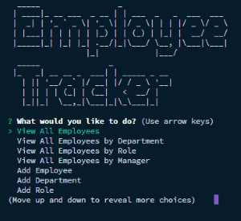

# Employee Tracker
[](https://lbesson.mit-license.org/)


## Description
Employee Tracker is a lightweight CLI that can be used to track employees for any company. It stores all of your departments, roles, managers, and employees in a MYSQL database and provides you with a full suite of tools to update and manager your records. Using MYSQL's built in protections, Employee Tracker also protects you from mistakes like accidentally deleting an entire department full of employees. Employee Tracker uses figlet and chalk for a beautiful terminal experience.

## Table of Contents
* [Installation](#Installation)
* [Usage](#Usage)
* [License](#License)
* [Questions](#Questions)

## Installation
To install necessary dependencies, run the following command:
```
npm install
``` 

## Usage
After launching Employee Tracker simply follow the prompts to input your employees. Start at the highest level with departments, then roles, then managers, then employees, as each level will need to reference the level above when you input it. Once you have all your employees entered into the database, make use of the multiple features to view and update your employees as you need!

## License
[](https://lbesson.mit-license.org/) 

This application is covered by the MIT license.

## Questions
Find all of my repos at elijah415hz. 

Please email me at elijahblaisdell@gmail.com with any questions.
